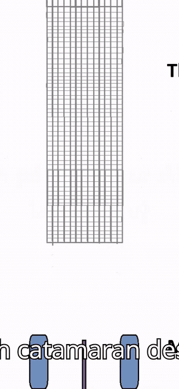
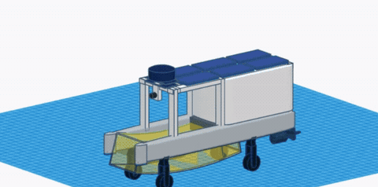
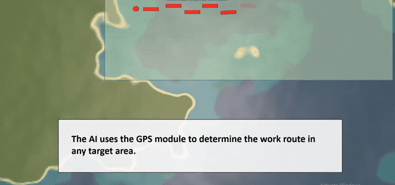
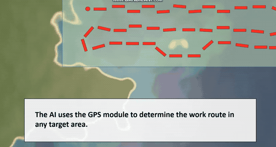
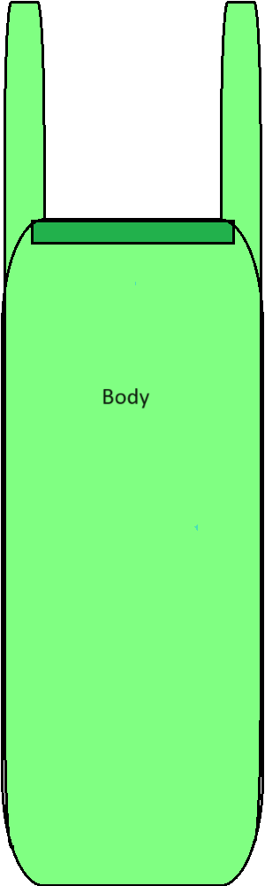
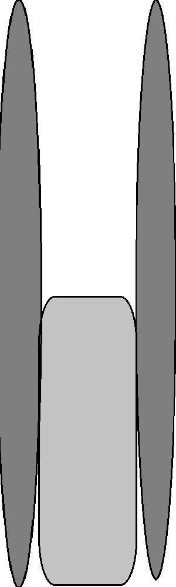

# ATCAN

**Autonomous Trash Collection & Aqua Navigation robot**

A solar powered twin hull surface vessel that finds and collects floating
plastic waste without an operator on board.

Smart India Hackathon 2024, problem statement **SIH1603**. Team ATCAN.
September 2024.

---

## Status

**Concept and design. Never implemented in software.**

This repository holds the specification, the design reasoning and the original
drawings. There is no control code and no detection model here, because none
were written. Saying so up front is more useful than implying otherwise.

What it is worth reading for is the hull form, and how it got there.

---

## The vehicle

| | |
|---|---|
| Dimensions | 2.5 m x 0.75 m x 1.5 m |
| Bare mass | 80 kg, with a 60 kg budget for components |
| Top speed | 1.5 m/s |
| Power | Solar, roof mounted |
| Materials | Solid HDPE floats, PVC structure |
| Sensing | RADAR for obstacles, camera and AI detection for debris, GPS for routing, weight sensors for collection state |
| Cost | approx. USD 1700 / Rs. 1.4 lakh |

Two collection mechanisms were specified rather than one.

| | **ATCAN-CN** | **ATCAN-CB** |
|---|---|---|
| Mechanism | Horizontal net, mouth forward | Mesh conveyor into a draining box |
| Mass | Lighter | Heavier |
| Power draw | Lower | Higher |
| Speed | Faster | Slower |
| Stability | Calm water | Handles surface turbulence |
| Default for | Most deployments | Rough water |

Full numbers in [docs/SPECIFICATION.md](docs/SPECIFICATION.md).

---

## The design decision worth the repo

The vehicle started as a cuboid with a net slot in front. It ended as a
catamaran. That change came from one observation.

**A single wide bow pushes a bow wave ahead of itself, and floating debris rides
that wave away from the vehicle.** The approach displaces the target. Two narrow
hulls with an open channel between them leave the water in the channel
undisturbed relative to the vehicle, so debris stays put and is delivered to the
intake instead of being shoved aside.

Two other decisions came the same way. Solid HDPE floats instead of inflatable
ones, because a vehicle that drives into floating debris will eventually drive
into something sharp and a puncture on an inflatable is a total loss. And the
net held horizontally with its mouth forward, because the target floats at the
surface interface, so the intake has to sit at the interface too.

Three decisions, none from a test, all from reasoning about what the water does
to the shape before committing to the shape.

Written up in [docs/DESIGN-EVOLUTION.md](docs/DESIGN-EVOLUTION.md).

---

## The build

Construction plan, top view. The mesh collection net sits in the channel between
the two hulls, and the body assembles behind it.

Labelled in order: the collection net, the catamaran multi hull, the visual
camera, the RADAR and solar panels, then the upper frame structure and the body.
Wheels at the stern so the vehicle can be dragged ashore.

## 3D models

Both variants were modelled in Tinkercad and are still live.

| Variant | Model |
|---|---|
| ATCAN-CN, collection net | [open in Tinkercad](https://www.tinkercad.com/things/2SJ2exZD5NJ-project-atcan-cn?sharecode=gtGMBqCVp-H5ocYRuEdGavWZATnF1qAFQHY5uO7CQJo) |
| ATCAN-CB, conveyor box | [open in Tinkercad](https://www.tinkercad.com/things/2pF9utFbsCY-project-atcan-cb?sharecode=-ppExi7yzbJ3OlkTagIZXAU7LBvpnSOtlTNatSzgXus) |

The CN variant on the water plane. The net is the yellow assembly slung under
the channel between the hulls.

## Operation

| Route planning | Detection |
|---|---|
|  |  |

The GPS module fixes a work route across the target area, and the vehicle runs
that path. RADAR finds solid objects nearby, then the camera classifies what the
RADAR found. Range from one sensor, identity from the other.

## Drawings

The two hand drawn top views the design started from, before the hull form
changed.

| Upper body and solar deck | Twin hulls |
|---|---|
|  |  |

The open channel between the bows is the intake. The body and solar deck sit aft
of it.

---

## Video

| | |
|---|---|
| Project film | https://www.youtube.com/watch?v=K_wUa_iPoN0 |
| SIH 2024 submission | https://www.youtube.com/watch?v=t05rDcHhw7w |

The project film is narrated. It opens on plastic pollution and its effect on
wildlife, moves to the people already doing this cleanup by hand and why that
does not scale, then introduces ATCAN with construction animations and the 3D
model. It closes on "Let's save nature, Together".

Scored with *Cipher* by LEMMiNO. Some clips in both videos are not owned by the
team and belong to their respective owners.

---

## Provenance

The original project document is lost. It was stored in Google Drive and has
since been deleted, and the folder it lived in was later reused for other work.
**The 3D models are not lost**, both are still live in Tinkercad and linked above.

Everything else here is reconstructed from the September 2024 design sessions,
which were preserved in full, plus the two drawings recovered from those
sessions, the two Tinkercad models, and frames pulled from the submission video.

The animations on this page are cut from the SIH submission video, from the
section that is original work. None of the stock footage used elsewhere in that
video appears here.

Where this repository states a number, that number came from the original
submission. Where it explains a decision, that explanation is traceable to a
message written at the time. Nothing has been backfilled from memory.
